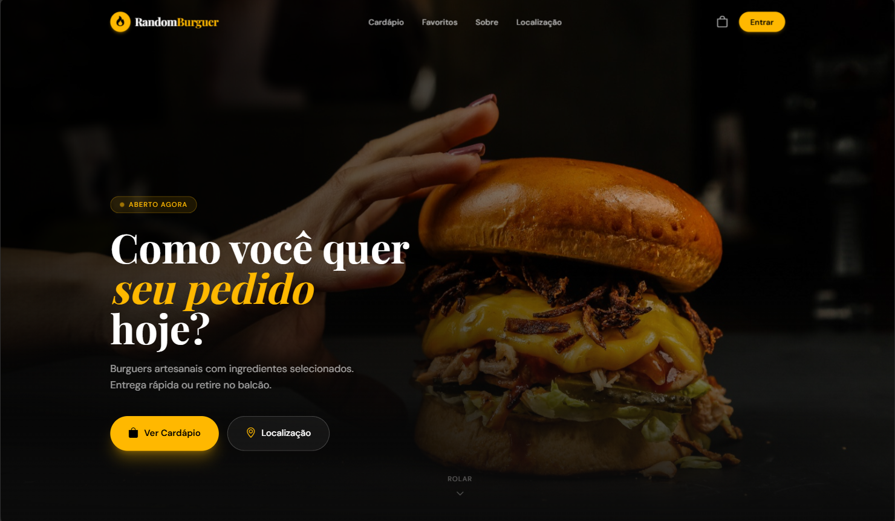
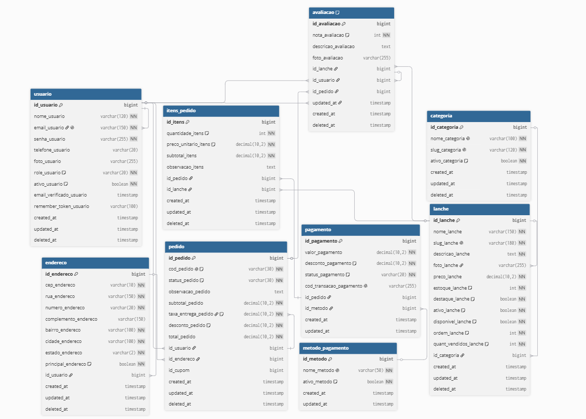

# Random Burguer


Sistema web completo para gerenciamento e venda de lanches, desenvolvido com Laravel, Tailwind CSS e Docker.

O projeto foi construído aplicando conceitos de Engenharia de Software, incluindo levantamento de requisitos, modelagem de banco de dados, documentação de casos de uso e desenvolvimento de API REST para autenticação e gerenciamento de usuários.
Além disso, segue o padrão arquitetural MVC (Model-View-Controller).
---

## Demonstração

### Área do Cliente



### Área Administrativa


### Modelagem do Banco de Dados



---

## Funcionalidades

### Cliente

* Cadastro de usuário
* Login seguro
* Visualização do cardápio
* Carrinho de compras
* Gerenciamento de itens do carrinho
* Finalização de pedidos
* Perfil do usuário

### Administrador

* Dashboard administrativo
* Gestão de usuários
* Cadastro de lanches
* Edição de lanches
* Exclusão de lanches
* Cadastro de categorias
* Controle de estoque
* Gerenciamento de pedidos

---

## 🛠 Tecnologias Utilizadas

### Backend

* PHP
* Laravel
* Laravel Sanctum
* MySQL

### Frontend

* HTML5
* Tailwind CSS
* JavaScript

### Infraestrutura

* Docker

### Engenharia de Software

* Levantamento de Requisitos
* Casos de Uso
* Modelo Entidade-Relacionamento (MER)
* Documentação Técnica

---

## Estrutura do Projeto

```bash
app/
database/
docker/
public/
resources/
routes/
storage/
documentacao/
```

---

## API REST

O projeto disponibiliza endpoints para autenticação e gerenciamento de usuários.

### Autenticação

```http
POST /api/auth/login
POST /api/auth/cadastro
POST /api/logout
```

### Usuário Autenticado

```http
GET /api/me
```

### Clientes

```http
GET    /api/clientes
GET    /api/clientes/{id}
PATCH  /api/clientes/{id}
DELETE /api/clientes/{id}
```

### Segurança

* Laravel Sanctum
* Rotas protegidas por autenticação
* Rate Limiting
* Controle de acesso baseado em permissões

---

## 🗄 Banco de Dados

O sistema utiliza MySQL para persistência dos dados.

Principais entidades:

* Usuários
* Clientes
* Categorias
* Lanches
* Pedidos
* Itens do Pedido
* Estoque

A modelagem foi documentada através de um Modelo Entidade-Relacionamento (MER).

---

## Engenharia de Software

A documentação do projeto contempla:

* Requisitos Funcionais
* Requisitos Não Funcionais
* Casos de Uso
* Modelo Entidade-Relacionamento (MER)
* Regras de Negócio
* Dicionário de Dados

Toda documentação pode ser encontrada na pasta:

```bash
documentacao/
```

---

## ⚙️ Instalação

### 1. Clonar o repositório

```bash
git clone https://github.com/arrudoprogramador/Random-Burguer.git
cd Random-Burguer
```

### 2. Instalar dependências PHP

```bash
composer install
```

### 3. Instalar dependências JavaScript

```bash
npm install
```

### 4. Configurar ambiente

```bash
cp .env.example .env
```

Gerar a chave da aplicação:

```bash
php artisan key:generate
```

### 5. Configurar banco de dados

Edite o arquivo `.env` com as credenciais do seu banco MySQL.

### 6. Executar migrations

```bash
php artisan migrate
```

### 7. Iniciar o Vite

```bash
npm run dev
```

### 8. Iniciar o servidor Laravel

```bash
php artisan serve
```

A aplicação estará disponível em:

```txt
http://localhost:8000
```


---

## 🐳 Docker

O projeto possui suporte para execução em containers Docker.

```bash
docker compose up -d
```

---

## Objetivos do Projeto

Este projeto foi desenvolvido com o objetivo de:

* Aplicar conceitos de Engenharia de Software.
* Desenvolver uma aplicação full stack utilizando Laravel.
* Implementar autenticação baseada em tokens.
* Criar uma API REST segura.
* Praticar modelagem de banco de dados.
* Simular um ambiente real de gerenciamento de vendas.

---

## Melhorias Futuras

* Relatórios de vendas
* Dashboard analítico
* Integração com pagamentos online
* Sistema de cupons
* Avaliação de produtos
* Notificações em tempo real
* Testes automatizados

---


## 📄 Licença

Este projeto foi desenvolvido para fins de estudo, aprendizado e composição de portfólio profissional.
